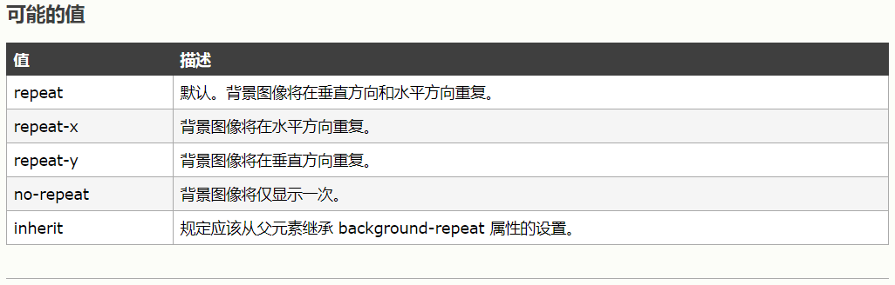
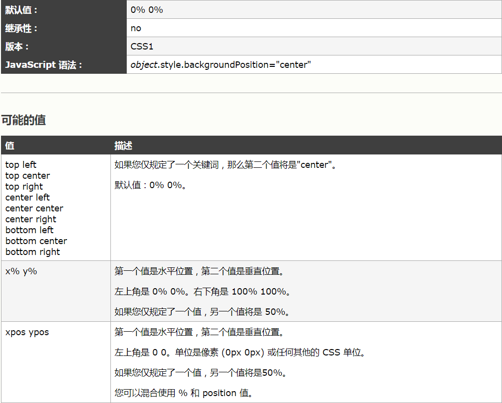

# 背景边框链接和更复杂的选择器
## w3school
### css背景
  背景色：background-color:gray;背景图片:  
  background-image:url(图片地址); 背景重复:background-repeat:repeat-y;可以向x,y方向来重复背景图片。

  值|描述
  ---|---
  repeat|默认。背景图像将在垂直和水平方向重复
  repeat-x|背景图像将在水平方向重复

  
  #### 背景图片的位置:background-position:
  你需要把background-attachment属性设置为"fixed"，才能保证该属性在Firefox和Opera 正常工作，当内容滚动时，指定元素背景的行为，例如，它是滚动的内容，还是固定的?
    
  坐标位置:图像的左上角是原点(0,0)。把背景想象成一个图形，先从左到右，y坐标从上到下  

  该属性可以接受不同类型的值:  
  像px这样的绝对值:background-position:200px 25px;  
  像rems这样的相对值:background-position:20rem 2.5rem;  
  百分比:background-position:90%  25%;  
  关键字:background-postion:right center;  

# MDN什么是背景
## 什么是背景？
background-clip:可以改变背景所占用的区域（设置元素的背景（背景图片或者是颜色）是否要延伸到边框下面）
background-clip:border-box;背景延伸到边框外沿（但在边框之下)  
background-clip:padding-box;边框下面没有背景，即背景延伸到内边距外沿  
background-clip:content-box;背景裁剪到内容区外沿  
background-clip:tex;背景被裁剪为文字的前景色（只有chrome支持）  
## 背景图像:渐变  
### 线性渐变:  
线性渐变是通过linear-gradient()函数传入的，它是一个background-image属性的值。函数至少需要用逗号来分隔的3个参数:背景中渐变的方向，开始颜色和结尾颜色。  
例如:background-image:linear-gradient(to bottom,orange,yellow);  
这个渐变将从上到下，从顶部的橙色开始，然后平稳的过渡到底部的黄色。可以使用关键字制定方向（to bottom,to right,to bottom right等）,或角度值（0deg相当于to top,90deg相当于  to right,直到360deg，它相当于to top）  
你也可以在颜色定义的渐变中指定其他的点——这些被称为颜色站点(color stops)，浏览器会计算出每一组颜色站点之间的颜色渐变。比如：  
background-image:liner-gradient(to bottom,yellow,orange 40%,yellow);  
注意:你还可以使用repeating-linear-gradient()函数来设置一个重复的线性渐变。它的工作方式完全相同，只不过你设置的模式会不断重复，直到背景的边框。例如:  
background-image:reqeating-linear-gradient(to fight,yellow,orange 25%,yellow 50%);  
这将会产生一个渐变，从黄色到橙色，在沿着渐变的每50个像素再回来  
## 背景附着  
background-attachment:属性是指定当内容滚动时他们是如何滚动的。有以下三种情况:  
scroll:会把背景修改为页面视图，背景不会滚动，只是文本内容滚动  
fixed:可以在页面的位置上固定背景，所以当页面滚动时，他不会滚动。  
local:  
## 背景简写  
background:yellow linear-gradient(to bottom,orange,yellow) no-repeat left center scoll;  
## 多个背景  
可以用逗号来分隔不同的背景定义  

background:rul(image.png) no-repeat 99% center,url(background-tile.png),linear-gradient(to bottom,yellow,#dddd00 50%,orange);  
也可以像普通的写法那样来写:  
background-image:url(),rul();  
background-repeat:no-repeat,repeat;  
## 背景尺寸  
background-size:16px 16px;  
## CSS边框  
每一个边框都有3个方面:宽度,样式，以及颜色。  
边框绘制在元素的背景之上。  
### 边框的样式  
border-style:.....  
例如:可以把一幅图片的边框定义为outset，使之看上去像是凸起按钮。  
a:like img{border-style:outset}  
### 定义多种样式  
例如:可以为一个边框定义多个样式  
p{border-style:solid dotted dashed double}  
### 定义单边样式  
border-top-style:......  
border-right-style:  
border-bottom-style:  
border-left-style:  
### 边框的宽度  
border-width:......  
例如:border-width:20px;border-width:thin;border-width:medium;border-width:thick;  
### 定义单边宽度  
可以按照top-right-bottom-left  
p{border-style:solid;border-width:15px 4px 4px 3px;}  
也可以通过如何的例子:  
border-top-width:  
border-right-width:  
border-bottom-width:  
border-left-width:  
### 边框很重要的地方  
记得写上边框的样式，如果不写边框的样式，那么就不会显示边框。因此，如果你希望边框出现，就必须声明一个边框的样式。  
### 边框的颜色  
border-color:...  
一次可以接受最多4个颜色值。可以使用任何类型的颜色值 ，例如命名颜色也可以是十六进制的颜色  
border-color:blue rgb(25%,45%,34%) #bbb red;  
### 定义但边框颜色  
border-top-color:......  
### 透明边框  
border-color:transparent;  
## 使用css的样式边框  
### 边界半径  
border-radius:50%;可以生成一个正圆  
border-radius:20px;  
在不同的角落放置不同的大小的边界半径，你可以指定两个，三个或四个值，就想你使用paddding and  margin一样  
border-radius:20px 10px;  
border-radius:20px 10px 50px;  
border-radius:20px 10px 50px 0;  
### 椭圆形角  
你可以创建椭圆形角(x半径和y半径不同)。两个不同的半径用正斜杠(/)分隔  
border-radius:10px / 20px;  
border-radius:10px 30px / 20px 40px;  
注意:你可以使用任何长度单位来制定边界半径，例如:px,rems,%  
还可以使用普通的写法设置属性，分别设置边框的每一个边界半径:  
border-left-radius:  
border-top-radius:  
border-bottom-left-radius:  
border-bottom-right-radius:  
## 链接  
a:link{color:#F00000;}为被被访问的链接  
a:visited{color:#00ff99;}已经被访问的链接  
a:hover{color:blue;}鼠标指针移动到的链接  
a:active{color:#ccc;}  
当为链接的不同状态设置样式时，顺序是不同的  
a:hover必须位于a:link和a:visited之后  
a:active必须位于a:hover之后  
text-decoration:用于去掉链接中的下划线  
 

 
