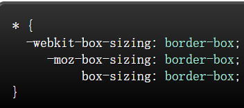

# 学习布局到定位
## MDND定位  
### 相对定位 position:absolute;  

该元素相对于自己在文档中的初始位置；  
注意:在使用相对定位时，无论是否进行移动，元素仍然占据原来的空间。移动元素会导致它覆盖其它框  
## 绝对定位 position:relative;  
该元素相对于其父元素，偏移一定的距离。如果元素没有一定位的祖先元素，那么它的位置是相对于最初的包含快(body)  
注意: 重点是这个父元素也要防止position属性。从最近的父元素开始找，直到找到body位置为止。  
无论是相对定位还是绝对定位都要配套的使用:top,left,right,bottom，定位才会有效  
## z-index:  
z-index:属性指定一个元素堆叠顺序  
注意:z-index：进行定位元素要在相对定位或者是绝对定位的基础上才可以使用z-index：，同时要在同级才能实现z-index：(兄弟关系元素)  
z-index:2>z-index:1;值越大越在上面  
## CSS布局  
### displsy属性  
display的属性有:block(块级元素)，inLine(行内元素)  
block  

常用的块级元素有:div,p,form和thml5的header,footer,section  
inline  
行内元素:span,a  
none  
display:none;  
例如:script：display:none;通常被JavaScript用来在不删除元素的情况下隐藏或显示元素  
注意:display:none;元素不会占据它本开应该显示的空间，但是设置成visibility:hidden;还会占据空间  
### margin:auto;  
#main{width:600px;margin:0px auto;}  
max-width:600px;替代width:600px;可以使浏览器更好的处理窗口的情况。这点在移动设备上显的尤为重要。  
### 盒模型  
当你设置元素的宽度时，实际展现的元素却超出你的设置:这是因为元素的边框和内边距都会撑开元素。盒模型就是解决这样的问题 
box-sizing:设置该属性时，此元素的内边距和外边距不会再增加它的宽度。  
可以把所有以下的代码添加到CSS页面上:  
  
这样可以确保所有的元素都会用这种更直观的方式排版。  
box-sizing：是个很新的属性，目前要在box-sizing：boxder-box;的前面使用-webkit和-moz-前缀  
## position  
相对定位:position:relative;固定定位:postion:fixed;绝对定位:position:absolute;  
## clear  
clear属性被用于控制浮动。  
例如:clear:left;clear:right;clear:both;  
### 清除浮动:clearfix  
overflow:auto;  
zoom:1;  
### 百分比宽度  
百分比对于图片的放大缩小很有用，一般不会失真  
## 媒体查询  
## inline-block  
block:块级元素会独占一行，并可以设置width,height  
inline：内联元素不会产生换行，一系列的inline元素都在一行内显示，直到该行内的内容排满  
inline-block:属性，可以设置具有宽度高度的特性，又具有同行的特性  
使用inline-bock:来布局的注意事项:  
.vertical-align:属性会影响到inline-block元素，你可能会把它设置为top  
.你需要设置每一列的宽度  
如果html源代码中的元素之间有空格，那么列与列之间会产生空隙  
# 学习CSS布局  
### display属性  
#### block 元素通常被叫做块级元素  
div是一个标准的块级元素  一个块级元素会新开始一行并且尽可能的撑满整个容器  
#### inline  元素通常被叫做行内元素  
span 是一个标砖的行内元素  一个行内元素可以在段落中打发打发包裹一些文字而不会打乱段落的布局  
a元素是最常用的行内元素  
#### none  
display:none;通常被JavaScript用来在不删除元素的情况下隐藏或显示元素但是设置成  
visibility:hidden;还会占居空间  
### box-sizing  
当你设置一个元素为box-siziing：border-box;时,次元素的内边距和边框不会再增加它的宽度。
*{-webkit-box-sizing:border-box;  
-moz-box-sizing:border-box;  
 box-sizing:border--box;}  
### position:fixed;固定定位  
#### clear:left;清除浮动  
### float元素具有破坏性 如何清除破坏性  
可以用清除元素浮动的方法来清除浮动的破坏性   
有四种方法:  
1.为父元素添加overflow:hidden;这样父元素就有了高度了，父元素的高度便不会被破坏  
2.浮动父元素  

其中个最重要也是必须掌握的方法是:  
.clearfix:after{

    content:"";  
    display:table;  
    clear:both;  

}  
.clearfix{
    *zoom:1;/*兼容个IE低版本*/
}

